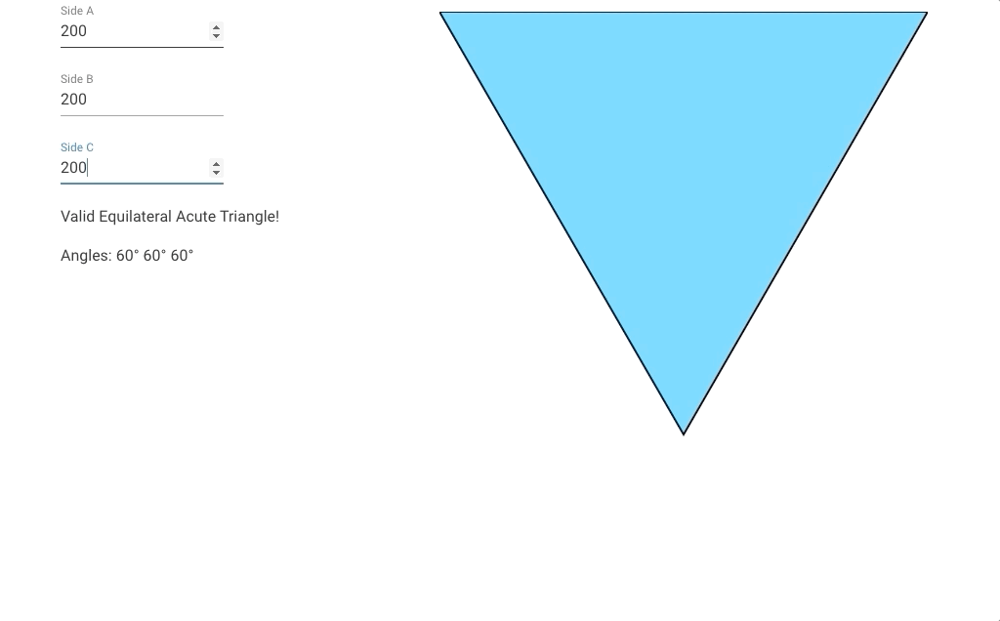

# triangle_app

## Project setup
```
yarn install
```

### Compiles and hot-reloads for development
```
yarn serve
```

### Compiles and minifies for production
```
yarn build
```

### Lints and fixes files
```
yarn lint
```

### Customize configuration
See [Configuration Reference](https://cli.vuejs.org/config/).

### Functionality
```
Enter three side lengths of a triangle. If the three lengths can make a valid triangle, the app displays the triangle along with the three angles in degrees and the type of triangle
```

